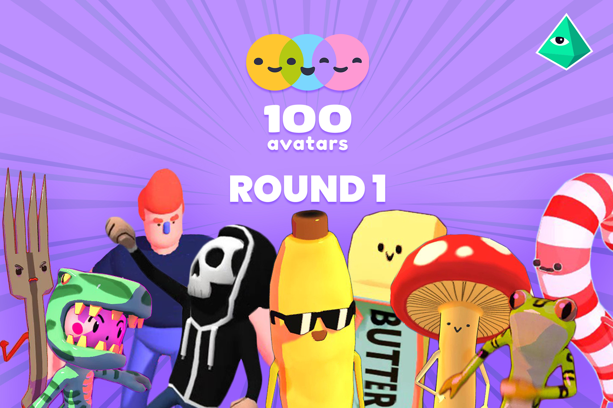
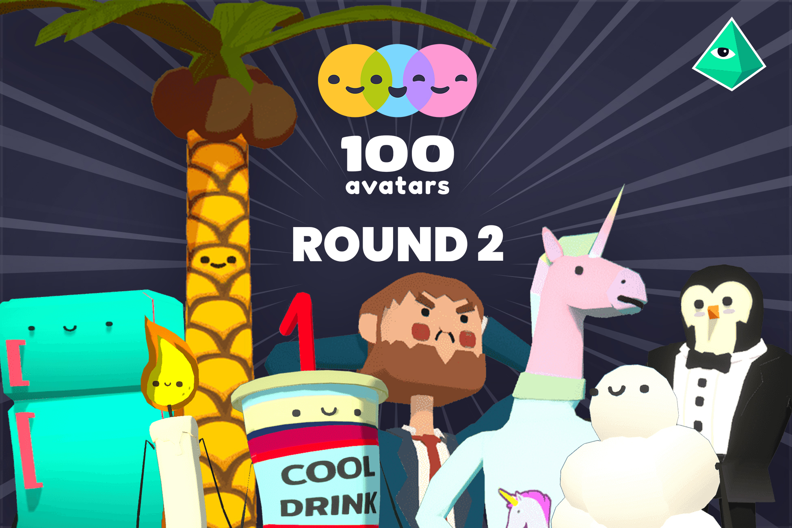
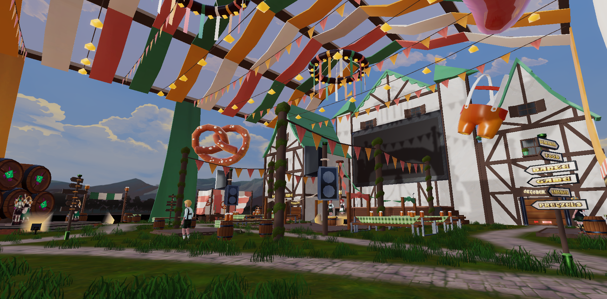

# Who are we?

# The Opensource Initiative

Polygonal Mind can now share some of its internal projects with the public, thanks to the Open Source Initiative's support. This projects falls under the license **CC0**, which means that you are free to use, modify, and distribute our work without any restrictions, even for commercial purposes, and without having to attribute the original creator. In other words, **CC0** is a legal tool for creators who want to make their work available to the public with the fewest restrictions possible.

Our team is eager to share our work with you and we sincerely hope that you find it beneficial.
[You can find more information about the CC0 license here.](https://creativecommons.org/share-your-work/public-domain/cc0/)
# Table of Contents

* Releases
  * [Character Packs](#character)
    * [100 Avatars R1](#100-avatars-r1)
    * [100 Avatars R2](#100-avatars-r2-character-pack)
  * [Asset Packs](#asset)
    * [Medieval Fair](#medieval-fair)
    * [Chromatic Chaos VHS](#chromatic-chaos)
    * [Momus Park](#momus-park)
    * [Tomb Chaser 1](#tomb-chaser-1)
    * [Tomb Chaser 2](#tomb-chaser-2)
    * [Avatar Garden](#avatar-garden)
    * [The Avatar Show](avatar-show)
  * [The Sandbox Packs](#the-sandbox)
    * [TSB Megapack](#tsb-megapack)
    * [Babylon](#babylon)
    * [Dethrone](#dethrone)
    * [Underworld](#underworld)

# Releases

# Character Packs

## 100 Avatars R1 Character Pack

 
Created during 2018, the 100 Avatars R1 Character Pack contains the first batch of avatars developed as a 1-avatar-per-day series. They are available as .fbx, .vrm, and .vxr, making them ready to use on almost every context and engine. Some of the most well-known avatars can be found here including the one and only Cool Banana.
 
With an easy to modify topology, they can be imported into any 3D editing software and freely modified.
 
The avatars adhere to the following themes: 

- Aliens 
- Monsters
- Adventurers
- Christmas 
- Food items 
 

[Link to the original Round 1](https://www.100avatars.com/es/round-1)
 
[Check the diorama at Skethfab](https://sketchfab.com/3d-models/100-avatars-r1-cc0-character-pack-c96f3ac9e8ee4bc192809e4a64bddfc2)
 
[Check the complete release notes in here, and download the pack!](https://github.com/PolygonalMind/initiative-opensource-release/releases/tag/230412.1) 

## 100 Avatars R2 Character Pack
 

 
Created during 2020, the 100 Avatars R2 Character Pack contains the second batch of avatars developed as a 1-avatar-per-day series. They are available as .fbx, .vrm, and .vxr, making them ready to use on almost every context and engine. This second round expands on every theme presented on the first one, focusing on many more Cool-series models. 
 
With an easy to modify topology, they can be imported into any 3D editing software and freely modified.
 
This package includes the avatar version of our company logo, the Poligonati.
   

[Link to the original Round 2](https://www.100avatars.com/es/round-2)
 
[Check the diorama at Sketchfab](https://sketchfab.com/3d-models/100-avatars-r2-cc0-character-pack-80cb24ac52cb4e839930aaa12314f716)
 
[Check the complete release notes in here, and download the pack!](https://github.com/PolygonalMind/initiative-opensource-release/releases/tag/230412.1) 

                      
# Asset Packs

## Medieval Fair Asset Pack

 
Created during a short interval of time before Oktoberfest (the german fest), this celebration was Medieval Fair's original purpose. It has now been modified and adapted, and can serve as the perfect building blocks for any kind of medieval festival.
 
This asset pack contains more than 35 game-ready assets.
   

[Check the diorama at Sketchfab](https://sketchfab.com/3d-models/medieval-fun-fair-cc0-asset-pack-d46e293701f1467a961b3eddfa0792db)
 
[Check the complete release notes in here, and download the pack!](https://github.com/PolygonalMind/initiative-opensource-release/releases/tag/230331.1)

       
## Chromatic Chaos VHS Asset Pack
  

[https://github.com/PolygonalMind/initiative-opensource-release/releases/tag/230410.1](https://github.com/PolygonalMind/initiative-opensource-release/releases/tag/230410.1)

                       
## MOMUS Park Asset Pack

https://github.com/PolygonalMind/initiative-opensource-release/releases/tag/230418.1

                  
## Tomb Chaser 1

## Tomb Chaser 2

## Avatar Garden

## The Avatar Show

  
# The Sandbox Packs

                      
## TSB Megapack     

  
## Babylon Asset Pack

https://github.com/PolygonalMind/initiative-opensource-release/releases/tag/230412.4                 
                      
 
## Dethrone Asset Pack

https://github.com/PolygonalMind/initiative-opensource-release/releases/tag/230412.3

## Underworld Asset Pack

https://github.com/PolygonalMind/initiative-opensource-release/releases/tag/230412.5
