# Who are we?

<a href="https://www.polygonalmind.com/" title="Polygonal Mind">
        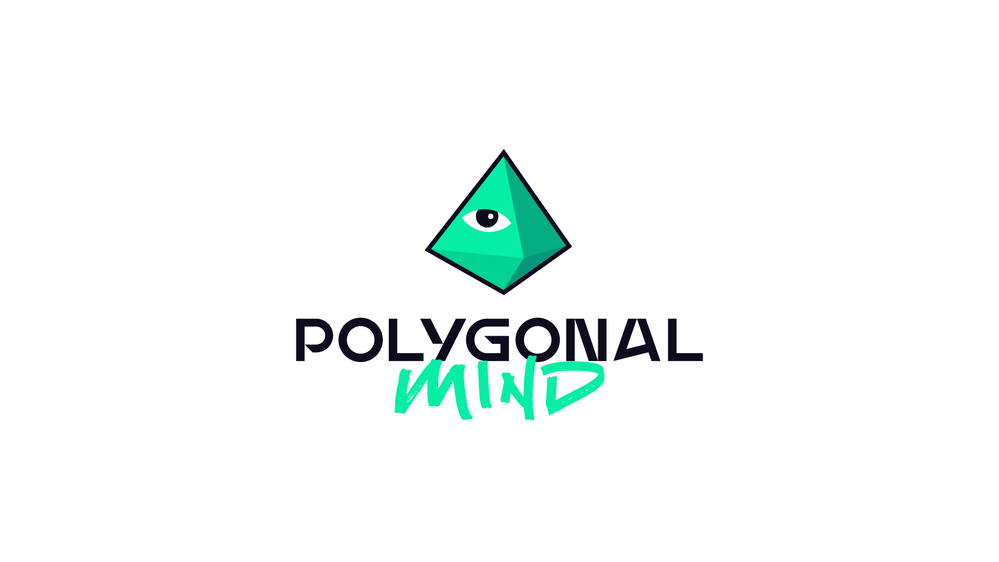 
</a>

Zaragoza based, 2015 estd.
 
We are a Creative Development Studio that imagines, designs and develops stunning environments, avatars, wearables, games and experiences for the metaverse.  
   
Take a look at [our website](https://www.polygonalmind.com/) to see what we are up to. 
 
You can also find us on [Twitter](https://twitter.com/polygonalmind?), [Instagram](https://www.instagram.com/polygonalmind/), and [Tik-Tok](https://www.tiktok.com/@polygonalmind).
 
Join our [Discord](https://discord.com/invite/jVEZYy4) server to stay on the loop.
 
Read our [blog](https://www.polygonalmind.com/blog) to learn more about our developments.

# The Opensource Initiative

Polygonal Mind can now share some of its internal projects with the public, thanks to the Open Source Initiative's support. This projects falls under the license **CC0**, which means that you are free to use, modify, and distribute our work without any restrictions, even for commercial purposes, and without having to attribute the original creator. In other words, **CC0** is a legal tool for creators who want to make their work available to the public with the fewest restrictions possible.

Our team is eager to share our work with you and we sincerely hope that you find it beneficial.  
[You can find more information about the CC0 license here.](https://creativecommons.org/share-your-work/public-domain/cc0/)
# Table of Contents

* Releases
  * [Character Packs](#character)
    * [100 Avatars R1](#100-avatars-r1)
    * [100 Avatars R2](#100-avatars-r2-character-pack)
    * [XYZ](#xyz)
  * [Asset Packs](#asset)
    * [ABM](#abm)
    * [Avatar Garden](#avatar-garden)
    * [CA World](#ca-world)
    * [Chromatic Chaos VHS](#chromatic-chaos)
    * [Medieval Fair](#medieval-fair)
    * [Momus Park](#momus-park)
    * [The Avatar Show](#avatar-show)
    * [Tomb Chaser 1](#tomb-chaser-1)
    * [Tomb Chaser 2](#tomb-chaser-2)
    * [Tomb Chaser 3 (Coming Soon)](#tomb-chaser-3)
  * [The Sandbox Packs](#the-sandbox)
    * [TSB Megapack](#tsb-megapack)
    * [Babylon](#babylon)
    * [Dethrone](#dethrone)
    * [Underworld](#underworld)

# Releases

# Character Packs

## 100 Avatars R1 Character Pack

Created during 2018, the 100 Avatars R1 Character Pack contains the first batch of avatars developed as a 1-avatar-per-day series. They are available as .fbx, .vrm, and .vxr, making them ready to use on almost every context and engine. Some of the most well-known avatars can be found here including the one and only Cool Banana.
 
With an easy to modify topology, they can be imported into any 3D editing software and freely modified.
 
The avatars adhere to the following themes: 

- Aliens 
- Monsters
- Adventurers
- Christmas 
- Food items 
 

[Link to the original Round 1](https://www.100avatars.com/es/round-1)
 
[Check the diorama at Sketchfab](https://sketchfab.com/3d-models/100-avatars-r1-cc0-character-pack-c96f3ac9e8ee4bc192809e4a64bddfc2)
 
[Read the complete release notes here, and download the pack!](https://github.com/PolygonalMind/initiative-opensource-release/releases/tag/230412.1) 

## 100 Avatars R2 Character Pack
 

Created during 2020, the 100 Avatars R2 Character Pack contains the second batch of avatars developed as a 1-avatar-per-day series. They are available as .fbx, .vrm, and .vxr, making them ready to use on almost every context and engine. This second round expands on every theme presented on the first one, focusing on many more Cool-series models. 
 
With an easy to modify topology, they can be imported into any 3D editing software and freely modified.
 
This package includes the avatar version of our company logo, the Poligonati.
   

[Link to the original Round 2](https://www.100avatars.com/es/round-2)
 
[Check the diorama at Sketchfab](https://sketchfab.com/3d-models/100-avatars-r2-cc0-character-pack-80cb24ac52cb4e839930aaa12314f716)
 
[Read the complete release notes here, and download the pack!](https://github.com/PolygonalMind/initiative-opensource-release/releases/tag/230412.1) 

## XYZ
 
<a href="https://github.com/PolygonalMind/initiative-opensource-release/releases/tag/230526" title="XYZ">
        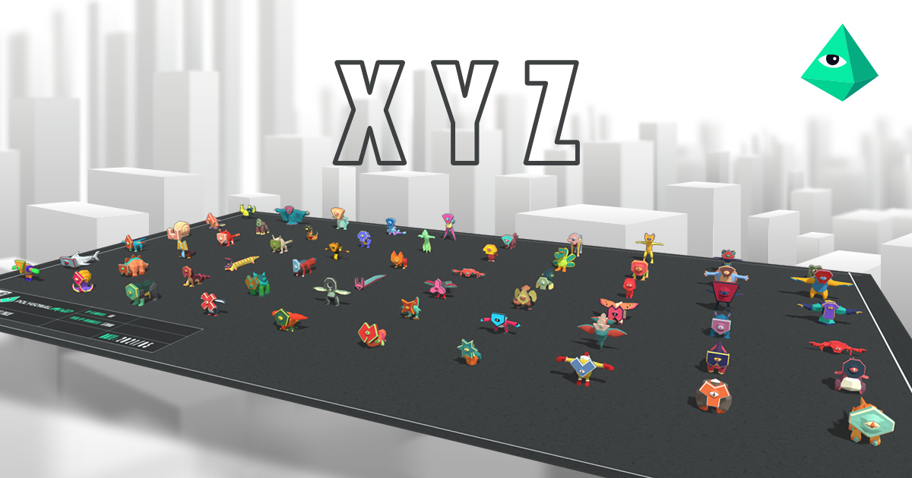 
</a>

XYZ figurines were designed for 3D printing with the new color printer. The project was delivered a couple of years ago in OBJ format, along with the textures. Now after this time we are free to release them with no extra charge or royalties to the original client.
 
These 60 creatures are textured, rigged, and ready to be included at any project.
 
With an easy to modify topology, they can be imported into any 3D editing software and freely modified.
   

[Check the diorama at Sketchfab](https://sketchfab.com/3d-models/xyz-cc0-asset-pack-298598e881844644a5c037f380d9bcc1)
 
[Read the complete release notes here, and download the pack!](https://github.com/PolygonalMind/initiative-opensource-release/releases/tag/230526) 

                      
# Asset Packs

## ABM

<a href="https://github.com/PolygonalMind/initiative-opensource-release/releases/tag/230515" title="ABM">
        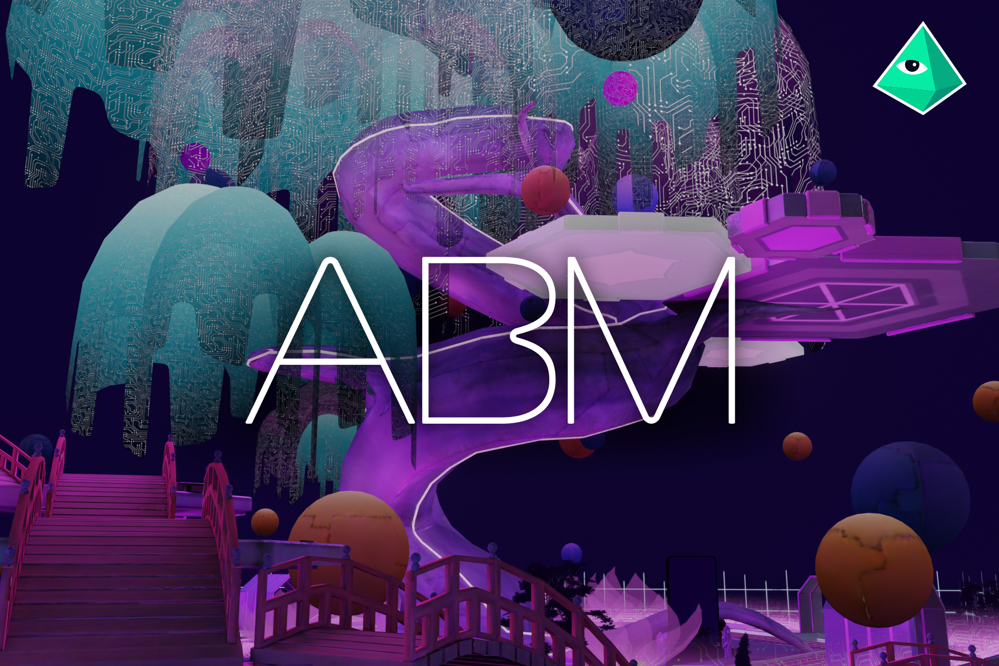 
</a>

ABM or Aetherian Block Museum is a Museum that contains the story of the creation of Blockchain and Ethereum divided into different stages.  The different points in history are represented via NFTs together with a description of what happened in that moment. 
 
This asset pack contains 65 different elements.
  

[Link to the Unity Asset Store]()
 
[Check the diorama at Sketchfab](https://sketchfab.com/3d-models/abm-cc0-asset-pack-bc92b5dbda4548118280ddf6bb63ad29)
 
[Read the complete release notes here, and download the pack!](https://github.com/PolygonalMind/initiative-opensource-release/releases/tag/230515) 

## Avatar Garden

<a href="https://github.com/PolygonalMind/initiative-opensource-release/releases/tag/230426.1" title="Avatar Garden">
        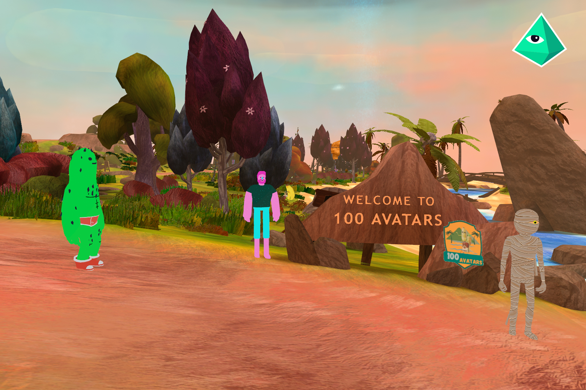 
</a>

The VRChat space that houses every avatar we have made so far for the 100 Avatars series. This project embodies the open-source origin and philosophy of the company, and it was at its time the first step towards the creation of CryptoAvatars. Its characteristic artstyle reminisces the characteristic brush strokes of Gauguin.
 
 This asset pack is made up of 130 different assets, ideal for arranging bucolic landscapes.
  

[Link to the Unity Asset Store]()
 
[Check the diorama at Sketchfab](https://sketchfab.com/3d-models/100-avatars-r1-cc0-character-pack-c96f3ac9e8ee4bc192809e4a64bddfc2)
 
[Read the complete release notes here, and download the pack!](https://github.com/PolygonalMind/initiative-opensource-release/releases/tag/230426.1) 

## CA World

<a href="https://github.com/PolygonalMind/initiative-opensource-release/releases/tag/230518" title="CA World">
        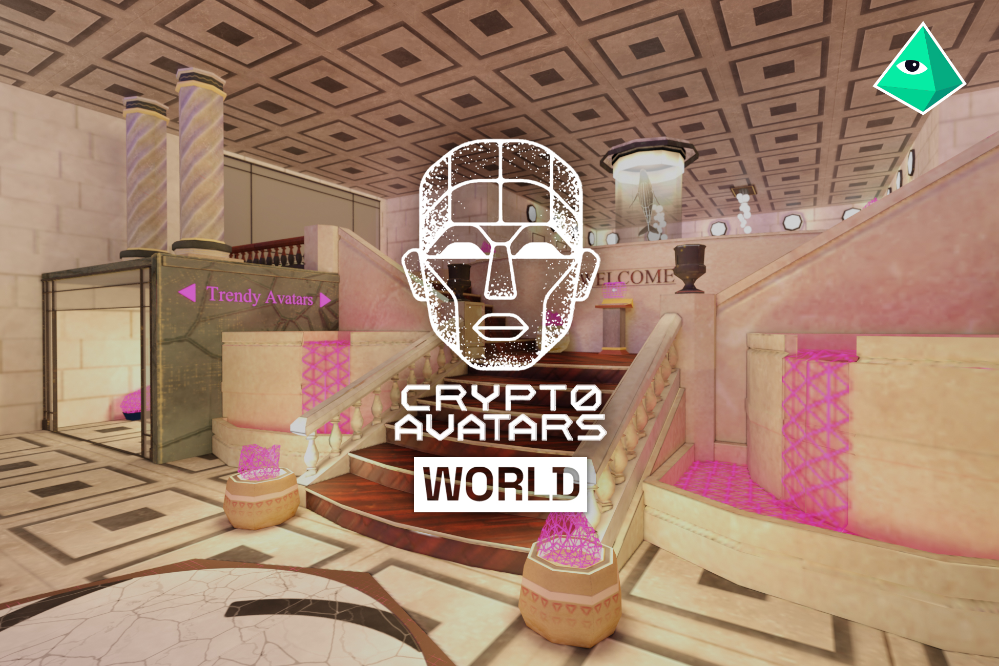 
</a>

The CryptoAvatars World Asset Pack contains numerous architectural and decorative elements typical of a mansion or museum. There are elegant tiled and parquet floors, sturdy columns, staircases and other decorative objects such as benches, statues, modern lighting and displays. It is a perfect mix of classical architecture and avant-garde objects.
 
This asset pack contains 65 different elements.
  

[Link to the Unity Asset Store]()
 
[Check the diorama at Sketchfab](https://sketchfab.com/3d-models/ca-world-cc0-asset-pack-7dba1f1b8d414aa79257fc13a123b2c7)
 
[Read the complete release notes here, and download the pack!](https://github.com/PolygonalMind/initiative-opensource-release/releases/tag/230518) 

       
## Chromatic Chaos VHS Asset Pack
  
<a href="https://github.com/PolygonalMind/initiative-opensource-release/releases/tag/230410.1" title="Chromatic Chaos VHS">
        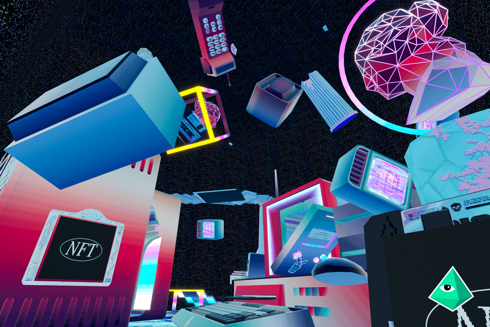 
</a>

One of the first projects developed during 2023 is a collaboration with MoCA. After deciding on a vaporwave aesthetic, we released a set of 5 rooms that can be used as galleries by their owners. These rooms have now been taken apart, allowing anyone to separately work on any asset and arrange their own dioramas.
 
 This package is for you if you're in need of 80s typical assets such as tube tvs, old Windows icons, or retro furniture equipment.
  

[Link to the original MoCA rooms]()
 
[Link to the Unity Asset Store]()
 
[Check the diorama at Sketchfab](https://sketchfab.com/3d-models/100-avatars-r1-cc0-character-pack-c96f3ac9e8ee4bc192809e4a64bddfc2)
 
[Read the complete release notes here, and download the pack!](https://github.com/PolygonalMind/initiative-opensource-release/releases/tag/230410.1) 

                       
## MOMUS Park Asset Pack

<a href="https://github.com/PolygonalMind/initiative-opensource-release/releases/tag/230418.1" title="MOMUS Pack">
        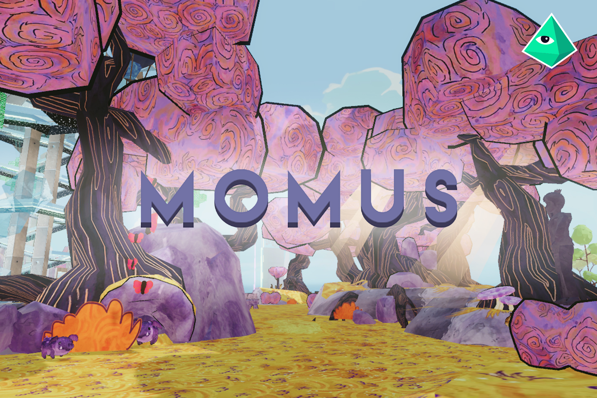 
</a>

Developed during 2020, and iterated over several times, the MOMUS Park...  The quick brown fox jumps over the lazy dog. The quick brown fox jumps over the lazy dog. The quick brown fox jumps over the lazy dog. The quick brown fox jumps over the lazy dog. The quick brown fox jumps over the lazy dog.
 
Fun fact, it is the models we use for testing Polygonal Mind applicants.
  

[Link to the original MOMUS park]()
 
[Link to the Unity Asset Store]()
 
[Check the diorama at Sketchfab](https://sketchfab.com/3d-models/100-avatars-r1-cc0-character-pack-c96f3ac9e8ee4bc192809e4a64bddfc2)
 
[Read the complete release notes here, and download the pack!](https://github.com/PolygonalMind/initiative-opensource-release/releases/tag/230418.1) 

## Medieval Fair Asset Pack

<a href="https://github.com/PolygonalMind/initiative-opensource-release/releases/tag/230331.1)" title="Medieval Fair">
        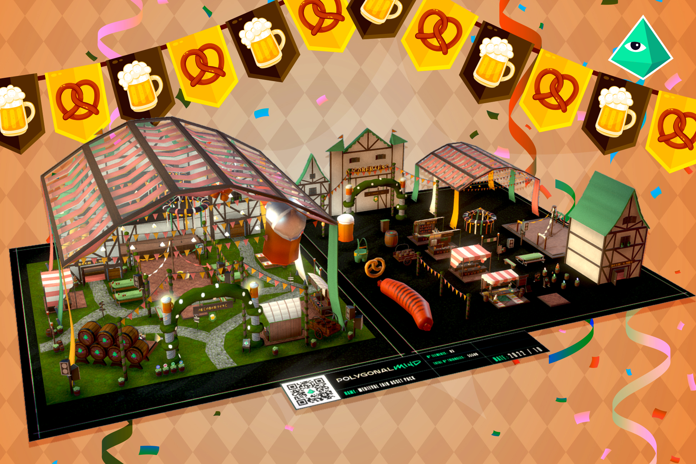 
</a>

Created during a short interval of time before Oktoberfest (the german fest), this celebration was Medieval Fair's original purpose. It has now been modified and adapted, and its assets can serve as the perfect building blocks for any kind of medieval festival.
 
Bring the fun to any fair. This pack contains barrels, food booths, wooden structures, lots of beer, and every other asset you can think of that makes a party legendary.
 
This asset pack contains more than 35 game-ready assets.
   

[Link to the Unity Asset Store]()
 
[Check the diorama at Sketchfab](https://sketchfab.com/3d-models/medieval-fun-fair-cc0-asset-pack-d46e293701f1467a961b3eddfa0792db)
 
[Read the complete release notes here, and download the pack!](https://github.com/PolygonalMind/initiative-opensource-release/releases/tag/230331.1)

## The Avatar Show

<a href="https://github.com/PolygonalMind/initiative-opensource-release/releases/tag/230426.2" title="The Avatar Show">
        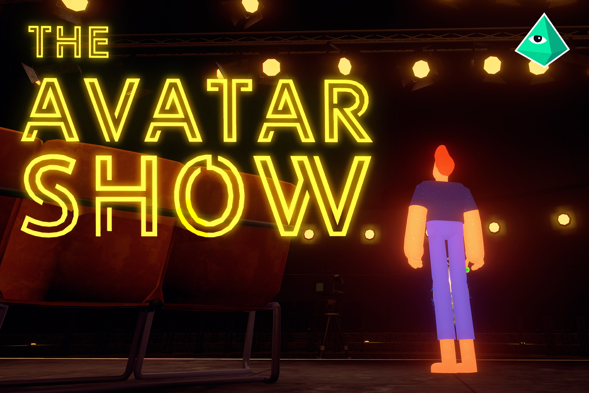 
</a>

Created as a late-night VRChat show, The Avatar Show, hosted by Polygonal Mind, is a virtual space designed around interviews. Specially focused around avatar and virtual reality creators, it is now available for everybody to use.
It includes decorative elements such as plants and carpets, as well as more functional elements such as seats, desks, and elegant armchairs.
 
This asset pack contains 50 different elements.
  

[Link to the Unity Asset Store]()
 
[Check the diorama at Sketchfab](https://sketchfab.com/3d-models/100-avatars-r1-cc0-character-pack-c96f3ac9e8ee4bc192809e4a64bddfc2)
 
[Read the complete release notes here, and download the pack!](https://github.com/PolygonalMind/initiative-opensource-release/releases/tag/230426.2) 

                  
## Tomb Chaser 1

<a href="https://github.com/PolygonalMind/initiative-opensource-release/releases/tag/230425.1" title="Tomb Chaser 1">
        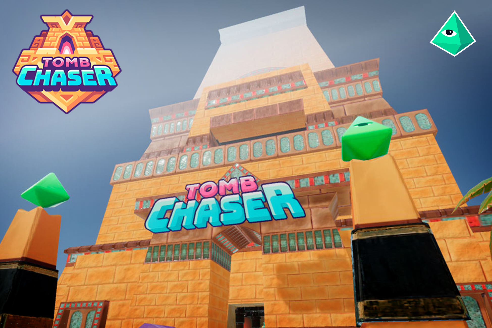 
</a>

The first ever platform game created for Decentraland! Developed during 2020, Tomb Chaser 1 follows the adventures of an tomb explorer, who encounters a ghost and has to solve a maze. Taking inspiration from Egypt, this first installment of the franchise has the user run inside of a pyramid full of spiky traps and astonishing brick textures and patterns.

If you are in need of sand, rocks, and ancient egyptian gods, this package is made for you.
  

[Link to the Unity Asset Store]()
 
[Check the diorama at Sketchfab](https://sketchfab.com/3d-models/100-avatars-r1-cc0-character-pack-c96f3ac9e8ee4bc192809e4a64bddfc2)
 
[Read the complete release notes here, and download the pack!](https://github.com/PolygonalMind/initiative-opensource-release/releases/tag/230425.1) 

## Tomb Chaser 2

<a href="https://github.com/PolygonalMind/initiative-opensource-release/releases/tag/230425.2" title="Tomb Chaser 2">
        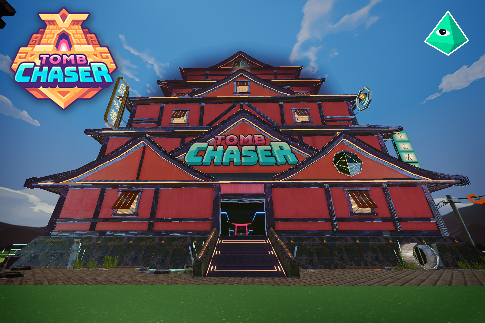 
</a>

The second installment of the Tomb Chaser series! Also built for Decentraland, this 2021 game follows the same dynamic as its predecessor. The difference is that this time the explorer has arrived at a neonwave japanese pagoda, and navigate through the neon labyrinth.
 
This package contains every necessary asset to replicate the original Tomb Chaser 2 pagoda or create your own. Neon lights mixed with traditional urban japanese-inspired building blocks. Mix them up and create your own unique artstyle.
  

[Link to the Unity Asset Store]()
 
[Check the diorama at Sketchfab](https://sketchfab.com/3d-models/100-avatars-r1-cc0-character-pack-c96f3ac9e8ee4bc192809e4a64bddfc2)
 
[Read the complete release notes here, and download the pack!](https://github.com/PolygonalMind/initiative-opensource-release/releases/tag/230425.2) 

## Tomb Chaser 3 (Coming Soon)

The quick brown fox jumps over the lazy dog. The quick brown fox jumps over the lazy dog. The quick brown fox jumps over the lazy dog. The quick brown fox jumps over the lazy dog. The quick brown fox jumps over the lazy dog. The quick brown fox jumps over the lazy dog. The quick brown fox jumps over the lazy dog. The quick brown fox jumps over the lazy dog.
  

[Link to the original project]()
 
[Link to the Unity Asset Store]()
 
[Check the diorama at Sketchfab]()
 
[Read the complete release notes here, and download the pack!]() 

  
# The Sandbox Packs

 The quick brown fox jumps over the lazy dog. The quick brown fox jumps over the lazy dog. The quick brown fox jumps over the lazy dog. The quick brown fox jumps over the lazy dog. The quick brown fox jumps over the lazy dog.
 

                      
## TSB Megapack     

<a href="TSB MegaPack" title="TSB MegaPack">
        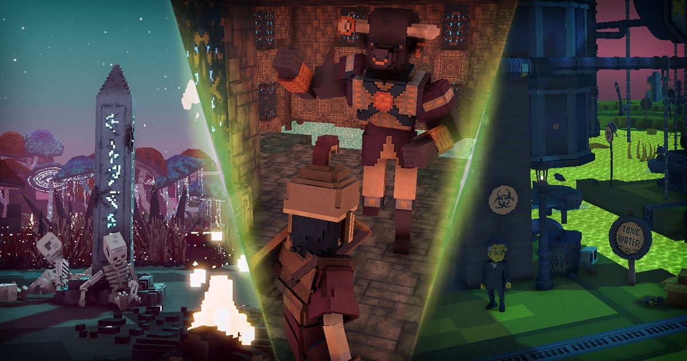 
</a>

If you feel brave enough, and think you can handle every The Sandbox asset internally developed by us, grab the whole pack at once and take a shot at it. 
 
Create an adventure that traverse several worlds and connects different cultures. We can't wait to hear what you come up with. This asset pack contains more than 500 assets.
  

[Read the complete release notes here, and download the pack!](https://github.com/PolygonalMind/initiative-opensource-release/releases/tag/230425.3)

  
## Babylon Asset Pack

<a href="Babylon Asset Pack" title="Medieval Fair">
        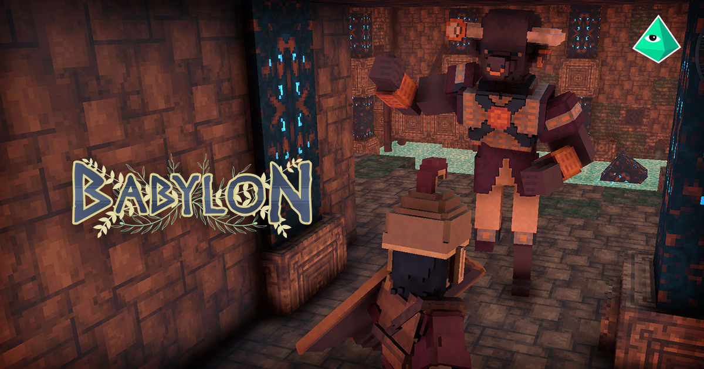 
</a>

Based on the first human civilizations, the Babylon asset pack is made up of vibrant assets that will help you create worlds with vivid colours. The twist is that most mesopotamian citizens are antropomorphic animals, adding a fun fantasy dash to the asset pack.
 
This pack contains more than 150 assets, taking into account blocks, models, and characters.
  

[Read the complete release notes here, and download the pack!](https://github.com/PolygonalMind/initiative-opensource-release/releases/tag/230412.4) 

 
## Dethrone Asset Pack

<a href="Dethrone Asset Pack" title="Dethrone">
        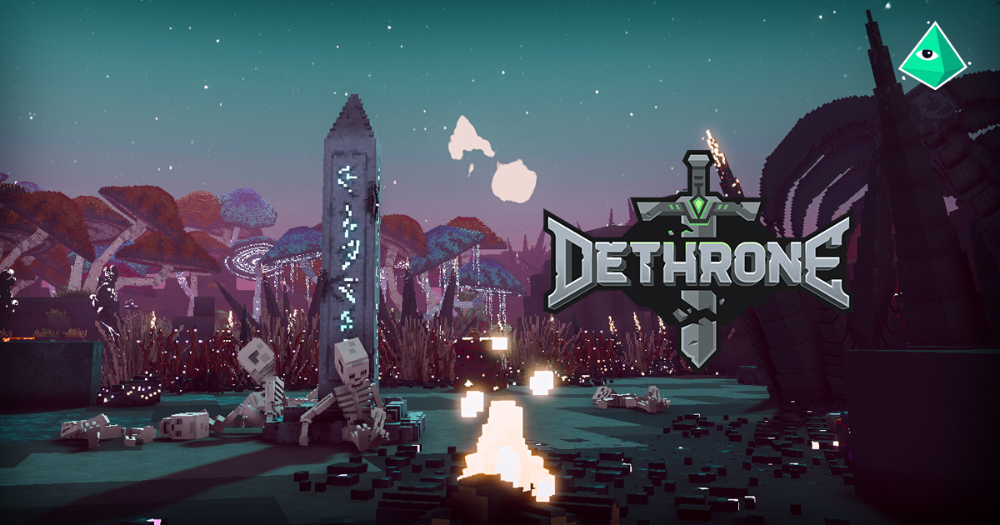 
</a>

The first ever The Sandbox single player adventure developed by Polygonal Mind. Created during 2019 and refined along the year 2021, it is the only experience that has multiple paths and that covers more than one land. With a very rich lore base, Dethrone is a perfect example of "less is more".
 
The asset pack contains 50 amazing rpg assets, taking into account blocks, models, and characters.
  

[Read the complete release notes here, and download the pack!](https://github.com/PolygonalMind/initiative-opensource-release/releases/tag/230412.3) 

## Underworld Asset Pack

<a href="Underworld Asset Pack" title="Underworld">
        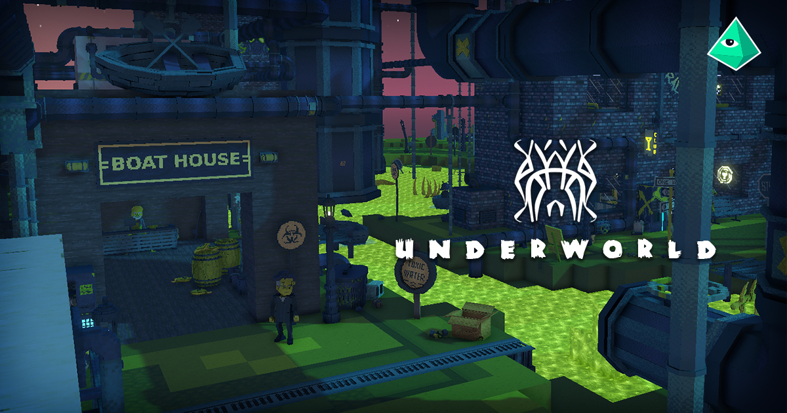 
</a>

Fashioned during Summer of 2022, Underworld is the third and final experience of Polygonal Mind's The Sandbox adventures. This time it's all about the sewers, and the mutants that live in them. Green toxic goo and corroded metals are the main protagonists of this pack. 
 
This is the most crowded bundle, as it contains more than 300 assets, taking into account blocks, models, and characters.
  

[Read the complete release notes here, and download the pack!](https://github.com/PolygonalMind/initiative-opensource-release/releases/tag/230412.5) 

